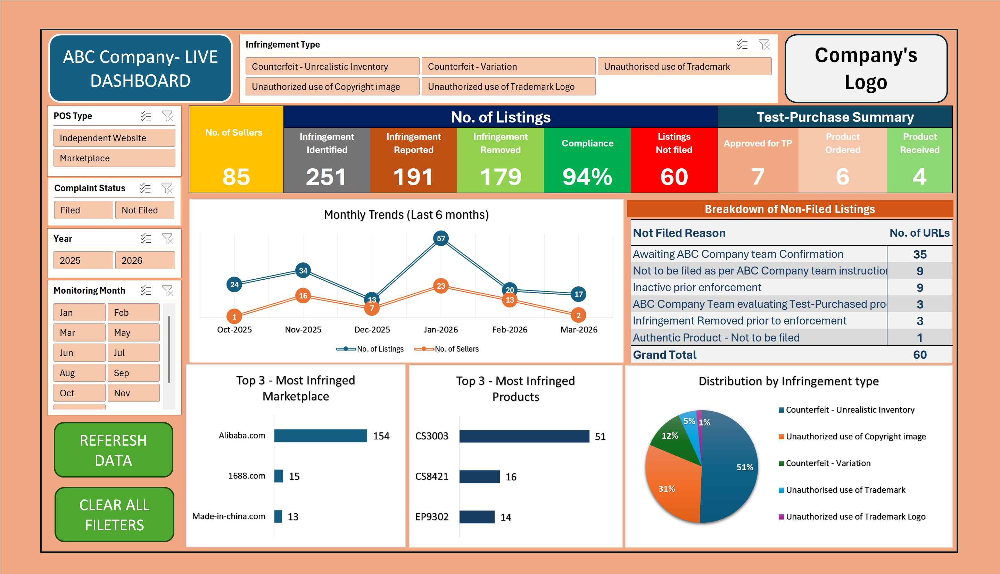

# 📊 Brand Protection Dashboard (Microsoft Excel)

## Overview

This dashboard was designed to help stakeholders monitor brand protection performance through an interactive Excel reporting interface. It consolidates operational metrics into a single view, allowing users to filter data, track KPIs, and identify trends efficiently.

## Dashboard Preview

## Features

- Interactive dashboard
- KPI cards
- Pivot Tables
- Pivot Charts
- Slicers for dynamic filtering
- Trend analysis
- Executive summary reporting

## Tools Used

- Microsoft Excel
- Pivot Tables
- Pivot Charts
- Slicers
- Conditional Formatting
- Advanced Excel Formulas

## Skills Demonstrated

- Data Analysis
- Dashboard Design
- Data Visualization
- Business Intelligence
- KPI Reporting

## Notes

- Client information has been anonymized.
- Data has been replaced with publicly available sample data.
- Shared for portfolio purposes only.

## 👨‍💻 Author

**Yogesh Kumar**

Aspiring Data Analyst
